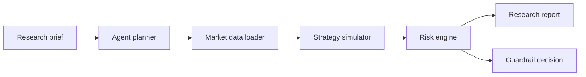

# Agentic Quant Lab

Agentic research workflow for quantitative strategies with explicit risk guardrails, reproducible backtests and paper-trading boundaries.

This repository is a CTO-grade portfolio system: it shows how an AI research agent can plan market hypotheses, run deterministic backtests, evaluate risk and produce a decision report without pretending to be a live trading bot.

> Research only. This project is not financial advice and does not execute live trades.

## Why This Exists

Most AI trading demos skip the controls that matter: data assumptions, risk limits, reproducibility, audit trails and failure modes. `agentic-quant-lab` keeps those concerns visible.

## Architecture



## Features

- Agent-style research planner that converts a brief into an executable experiment plan.
- Deterministic moving-average crossover backtest for a transparent baseline.
- Risk engine with max drawdown, volatility and trade-count checks.
- JSON report output suitable for review, CI artifacts or dashboard ingestion.
- Tests and CI to show engineering discipline.

## Quick Start

```bash
python -m venv .venv
source .venv/bin/activate
pip install -e ".[dev]"
python -m agentic_quant_lab.cli --symbol DEMO --cash 10000
pytest
```

## Example Output

```json
{
  "symbol": "DEMO",
  "decision": "paper_trade_only",
  "total_return": 0.084,
  "max_drawdown": -0.031,
  "risk_notes": ["Strategy passed drawdown and volatility limits."]
}
```

## Roadmap

- Add walk-forward validation.
- Add transaction cost and slippage models.
- Add experiment tracking export.
- Add integration examples for FinRL-style environments.

